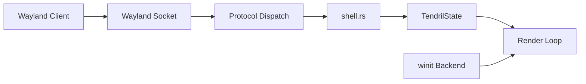

# Tendril

A minimal scroll-driven Wayland compositor with a fixed two-column layout, written in Rust with Smithay.

The workspace is a continuous vertical flow of windows inside two fixed columns. Scrolling moves the viewport, not the windows — there is no discrete workspace switching, no floating, no stacking, no mouse resize. Scroll is navigation.

## Status

- **Stage 1** — initialization: workspace structure, winit backend, calloop event loop, minimal rendering
- **Stage 2** — core state & geometry: `Window`, `Column`, `Workspace`, scroll math, unit tests
- **Stage 3** — Wayland surface handling: `CompositorHandler`, `XdgShellHandler`, listening socket, client dispatch, surface rendering, frame callbacks

## Usage

```bash
cargo run --bin tendril
```

Runs as a nested compositor window. The Wayland socket is auto-selected (`WAYLAND_DISPLAY` is printed in the log).

## Architecture



- `tendril/` — compositor core
  - `src/main.rs` — entry point, `AppState` owns `Display` + `TendrilState`
  - `src/state.rs` — `Config`, `Window`, `Column`, `Workspace`, `TendrilState`, geometry, rendering
  - `src/shell.rs` — protocol handlers (compositor, xdg-shell, shm, seat), `AppClientState`
  - `src/input.rs` — placeholder (Stage 4)
  - `src/render.rs` — placeholder
- `tendril-ipc/` — IPC library (Stage 5)
- `tendrilc/` — CLI client (Stage 5)

## License

MPL 2.0 — see [LICENSE](LICENSE).
