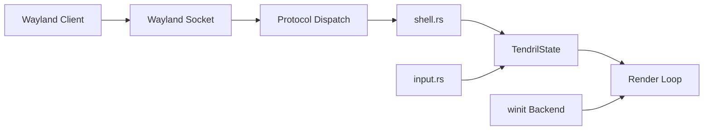

# Tendril

A scroll-driven Wayland compositor with a fixed two-column layout, written in Rust with [Smithay].

[Smithay]: https://github.com/Smithay/Smithay

## How It Works

Windows are arranged in two side-by-side columns. Each column acts as a vertical strip
that you scroll through — windows don't overlap or resize; they stay at a fixed height
and the strip moves under the viewport. Scroll the strip with `Mod+Scroll`, navigate
between windows with `h`/`j`/`k`/`l`, and reorder them with `Mod+Shift` + arrows.

Tendril runs as a nested compositor inside an existing X11 or Wayland session using the
`winit` backend. This lets you develop and test without leaving your current desktop.
A native KMS/DRM mode is planned.

## Features

- Two-column tiling — new windows are placed in the less-populated column
- Scroll-driven navigation — scroll the strip (Mod+wheel) or move focus with hjkl
- Keyboard-driven window management — focus and reorder without touching the mouse
- Nested mode — runs inside your existing X11/Wayland session via winit
- IPC & CLI — Unix socket JSON-RPC 2.0 protocol and `tendrilc` command-line client
- TOML configuration — `~/.config/tendril/config.toml`
- Z-effect — reordered windows get a subtle scale bump (`scale=1.05`) that fades after 500ms
- Smooth LERP scroll animation — per-column spring-like interpolation
- Popup surface support — menus, dropdowns, tooltips work (GTK/Qt)
- Damage-aware rendering — column-sized damage regions, full-viewport only on content changes
- 5 workspaces — columns and focus are per-workspace

## Architecture



| Module | Role |
|---|---|
| `state.rs` | Core geometry, scroll math, rendering pipeline, `Config` |
| `shell.rs` | Protocol handlers (xdg-shell, compositor, seat, shm, data-device) |
| `input.rs` | Keyboard navigation, pointer events, scroll gating, reorder |
| `render.rs` | Rendering pipeline (clear, draw, frame callbacks, damage regions) |
| `ipc.rs` | Unix socket JSON-RPC server, calloop `EventSource` |
| `tendril-ipc/` | Shared IPC types and JSON-RPC 2.0 envelope |
| `tendrilc/` | CLI client with `clap` subcommands |

## Quick Start

```bash
git clone https://github.com/moloo4ni/tendril.git
cd tendril
RUST_LOG=info cargo run --bin tendril
```

The compositor opens a nested window. The Wayland socket name is printed in the log.
Launch applications inside it with:

```bash
WAYLAND_DISPLAY=wayland-2 kitty
```

Or use `./run.sh` to start the compositor with six `kitty` terminals automatically.

## Controls

| Input | Action |
|---|---|
| `Mod+h` / `Mod+←` | Focus left column |
| `Mod+l` / `Mod+→` | Focus right column |
| `Mod+j` / `Mod+↓` | Focus next window down |
| `Mod+k` / `Mod+↑` | Focus previous window up |
| `Mod+Shift+h` / `Mod+Shift+←` | Move window left (up in list) |
| `Mod+Shift+l` / `Mod+Shift+→` | Move window right (down in list) |
| `Mod+Shift+j` / `Mod+Shift+↓` | Move window down |
| `Mod+Shift+k` / `Mod+Shift+↑` | Move window up |
| Pointer motion | Focus window under cursor |
| Pointer click | Forward button to focused app |
| Scroll (no Mod) | Forward to focused app |
| `Mod` + Scroll | Scroll active column strip |
| `Mod+Shift` + Scroll | Reorder window (swap + Z bump) |

`Mod` = left or right Super key (Windows / Command).

## Roadmap

All 6 stages are complete. See [PLAN.md](PLAN.md) for the full roadmap and future
ideas.

## License

MPL 2.0 — see [LICENSE](LICENSE).
