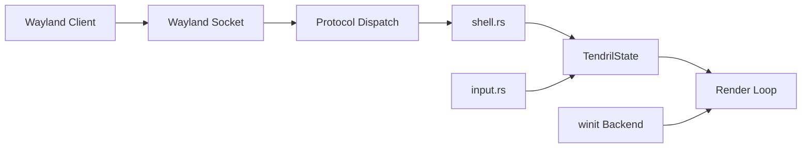

# Tendril

A minimal scroll-driven Wayland compositor with a fixed two-column layout, written in Rust with Smithay.

## Status

| Stage | What | Done |
|---|---|---|
| 1 | Workspace structure, winit backend, calloop event loop, minimal rendering | ✓ |
| 2 | Core state & geometry: `Window`, `Column`, `Workspace`, scroll math, unit tests | ✓ |
| 3 | Wayland surface handling: `CompositorHandler`, `XdgShellHandler`, listening socket, client dispatch, surface rendering, frame callbacks | ✓ |
| 4 | Input handling: Mod/Super tracking, keyboard forwarding, pointer motion/button/axis, scroll gating, focus-on-hover, keyboard navigation (hjkl), window reorder with Z-effect | ✓ |
| 5 | IPC — Unix socket, JSON-RPC protocol, `tendrilc` CLI client | |
| 6 | Rendering & animations — damage tracking, smooth LERP scroll, Z-axis effect (partial: scale=1.05 on reorder) | ⟳ |

## Known Issues

- **Mod+Scroll (mouse wheel) still broken** — directional snap (`ceil`/`floor`) and event gating implemented but wheel events may not reach the compositor when Mod is held inside Sway (host compositor intercepts). Trackpad scroll under Mod uses proximity snap (`round`) and may need larger gestures to advance.
- **Sway Mod key capture** — running nested under Sway, the host may capture the Mod key. Workaround: configure Sway with a different `$mod` or use key-toggled mod.
- **Z-effect rendering** — `scale=1.05` and sorted rendering work but `z_index_offset` is cleared each frame. Persistent visual feedback during reorder drag needs Stage 6 idle loop.

## Usage

```bash
cd tendril
RUST_LOG=info ./run.sh       # starts compositor + 6 kitty windows
# or manually:
RUST_LOG=info cargo run --bin tendril
```

Runs as a nested compositor window. The Wayland socket is auto-selected (`WAYLAND_DISPLAY` is printed in the log). Run apps inside with:

```bash
WAYLAND_DISPLAY=wayland-2 kitty
```

## Architecture



- `tendril/` — compositor core
  - `src/main.rs` — entry point, `AppState` owns `Display` + `TendrilState`, calloop event loop with winit + socket sources
  - `src/state.rs` — `Config` (gaps, visible_windows), `Window`, `Column` (scroll_offset, snap), `Workspace`, `TendrilState`, geometry math (symmetric gaps, window_y_position), rendering pipeline (sorted by z_index_offset, scale=1.05 on reorder), unit tests
  - `src/shell.rs` — protocol handlers (compositor, xdg-shell, xdg-decoration ClientSide, shm, seat, data-device), `AppClientState`, delegate macros, column-balanced window placement
  - `src/input.rs` — input event processing: Mod/Shift tracking, focus-on-hover, focus-follows-mouse, keyboard navigation (hjkl/arrows), scroll gating (Mod=WM, no-Mod=app), directional snap for wheel, proximity snap for trackpad, window reorder with Z-index bump, key release forwarding
  - `src/render.rs` — placeholder (Stage 6)
- `tendril-ipc/` — IPC types (Stage 5)
- `tendrilc/` — CLI client (Stage 5)

## Controls

### Keyboard

| Input | Action |
|---|---|
| `Mod+h` / `Mod+←` | Focus left column |
| `Mod+l` / `Mod+→` | Focus right column |
| `Mod+j` / `Mod+↓` | Focus next window down |
| `Mod+k` / `Mod+↑` | Focus previous window up |
| `Mod+Shift+h` / `Mod+Shift+←` | Move window left (up in list) |
| `Mod+Shift+l` / `Mod+Shift+→` | Move window right (down in list) |
| `Mod+Shift+j` / `Mod+Shift+↓` | Move window down |
| `Mod+Shift+k` / `Mod+Shift+↑` | Move window up |

### Mouse

| Input | Action |
|---|---|
| Pointer motion | Focus window under cursor (focus-follows-mouse) |
| Pointer click | Forward button event to focused app |
| Scroll (no Mod) | Forward to focused application |
| Mod + Scroll | Scroll active column strip (directional snap — needs fix) |
| Mod + Shift + Scroll | Reorder windows (swap + Z bump, scale=1.05) |

Mod = left or right Super key (Windows/Command key).

## License

MPL 2.0 — see [LICENSE](LICENSE).
