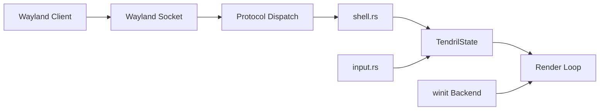

# Tendril

A minimal scroll-driven Wayland compositor with a fixed two-column layout, written in Rust with Smithay.

## Status

- **Stage 1** — initialization: workspace structure, winit backend, calloop event loop, minimal rendering
- **Stage 2** — core state & geometry: `Window`, `Column`, `Workspace`, scroll math, unit tests
- **Stage 3** — Wayland surface handling: `CompositorHandler`, `XdgShellHandler`, listening socket, client dispatch, surface rendering, frame callbacks
- **Stage 4** — input handling: Mod/Super key tracking, keyboard forwarding, pointer motion/button/axis events, Mod+Scroll column scrolling, pointer-click window focus

## Usage

```bash
RUST_LOG=info cargo run --bin tendril
```

Runs as a nested compositor window. The Wayland socket is auto-selected (`WAYLAND_DISPLAY` is printed in the log).

## Architecture



- `tendril/` — compositor core
  - `src/main.rs` — entry point, `AppState` owns `Display` + `TendrilState`, calloop event loop with winit + socket sources
  - `src/state.rs` — `Config`, `Window`, `Column`, `Workspace`, `TendrilState`, geometry math (scroll, visibility, layout), rendering pipeline (GLES, frame callbacks), unit tests
  - `src/shell.rs` — protocol handlers (compositor, xdg-shell, shm, seat, data-device), `AppClientState`, delegate macros
  - `src/input.rs` — input event processing: Mod/Shift tracking, keyboard forwarding, pointer motion/button/axis, scroll clamping, focus-on-click
  - `src/render.rs` — placeholder (Stage 6)
- `tendril-ipc/` — IPC types (Stage 5)
- `tendrilc/` — CLI client (Stage 5)

## Controls

| Input | Action |
|---|---|
| Mod + Scroll | Scroll active column |
| Mod + Shift + Scroll | Reorder windows (future) |
| Pointer click | Focus window under cursor |

Mod = left or right Super key (Windows/Command key).

## License

MPL 2.0 — see [LICENSE](LICENSE).
